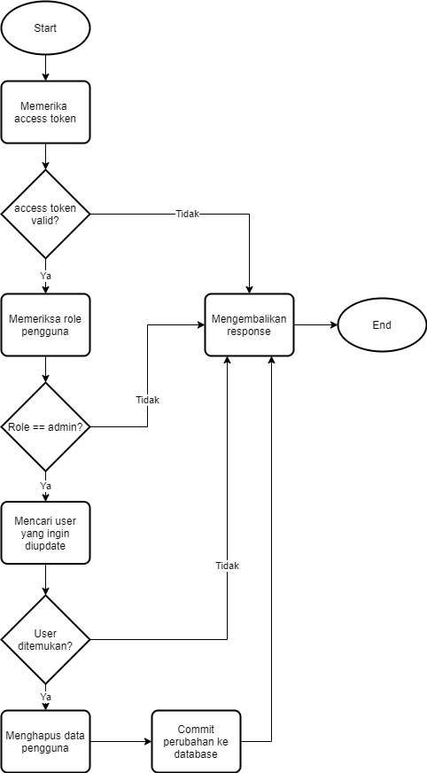

# Sejuta Cita Back End Test

## How to Run via Docker
``` bash
# Clone the Repository
$ git clone https://github.com/jamesvincentsiauw/expressjs-kubernetes.git

# Configure MongoDB Docker
$ docker pull mongo
$ docker run -it -v mongodata:/data/db --name mongodb -d mongo

# Get Mongo Container IP
$ docker inspect -f '{{range .NetworkSettings.Networks}}{{.IPAddress}}{{end}}' <mongo-container-id>

# Change db Config IP
$ sudo nano AuthContainer/config/database.config.js
$ sudo nano CRUDContainer/config/database.config.js

# Build and Run the Auth App Images
$ cd AuthContainer
$ docker build -t sejutacita-auth:latest .
$ docker run -p 3000:3000 -d sejutacita-auth

# Get Auth Container IP
$ docker inspect -f '{{range .NetworkSettings.Networks}}{{.IPAddress}}{{end}}' <auth-container-id>

# Change Auth Container IP address at line 195
$ sudo nano CRUDContainer/modules.js

# Build and Run the CRUD App Images
$ cd CRUDContainer
$ docker build -t sejutacita-crud:latest .
$ docker run -p 4000:4000 -d sejutacita-crud

# See Your Container Status
$ docker-compose ps

# Live IP
Auth: http://<your-ip-machine>:3000/
CRUD: http://<your-ip-machine>:4000/
```
## How to Run via Kubernetes
``` bash
# Clone the Repository
$ git clone https://github.com/jamesvincentsiauw/expressjs-kubernetes.git

# Create Pods
$ kubectl create -f .\deployment-auth.yaml
$ kubectl create -f .\deployment-crud.yaml
$ kubectl create -f .\deployment-db.yaml

# Configure Nginx Ingress
$ kubectl create -f .\kubernetes-ingress.yaml

# See Your Service Status
$ kubectl get services

# Live IP
Auth: http://<your-ip-service>:3000/
CRUD: http://<your-ip-service>:4000/
```

## API Flow
- *Login* 

- *Register*

- *Get User*

- *Edit User*

- *Delete User*


## Live IP Address for Test Need
Auth: http://188.166.209.39:3000/
CRUD: http://188.166.209.39:4000/